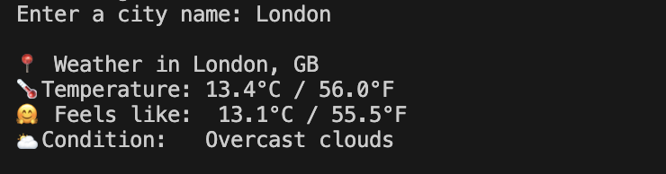

# 🌦️ Python Weather App

A simple command-line weather app written in Python that fetches real-time weather data for any city using the OpenWeatherMap API.  
It was built as part of my journey back into tech and to practice working with APIs, environment variables, and error handling.

---

## 📸 Demo

> Example of the app running in the terminal:



---

## ✨ Features

- Get current weather for any city 🌍  
- Shows temperature in **Celsius (°C)** and **Fahrenheit (°F)**  
- Displays “feels like” temperature  
- Shows basic condition (e.g. *clear sky, overcast clouds*)  
- Graceful error handling for:
  - Invalid or unknown city names  
  - Network/API issues  
  - Missing API key in `.env`

---

## 🛠 Tech Stack

- **Language:** Python 3  
- **HTTP Client:** `requests`  
- **Environment Variables:** `python-dotenv`  
- **API:** OpenWeatherMap (Current Weather Data)

---

## ⚙️ Setup

### 1️⃣ Clone the repo

```bash
git clone https://github.com/meronalemnew/Python-Weather-App.git
cd Python-Weather-App
### 2️⃣ Install dependencies

```bash
pip install -r requirements.txt
### 3️⃣ Create a `.env` file

In the project folder, create a file called `.env` and add:

```env
OPENWEATHER_API_KEY=your_api_key_here
### 4️⃣ Run the app

```bash
python3 weather.py
## 👩🏾‍💻 About This Project

This project demonstrates how to build a simple command-line weather application using Python and the OpenWeatherMap API.  
It focuses on:

- Making HTTP requests with `requests`  
- Working with environment variables through `python-dotenv`  
- Handling potential errors using `try/except`  
- Converting temperature units (Kelvin → Celsius → Fahrenheit)  
- Returning clean, readable output in the terminal  
- Following good project structure and version control practices  

The project is designed to be lightweight, easy to run, and extendable for future improvements such as multi-day forecasts or additional weather metrics.
